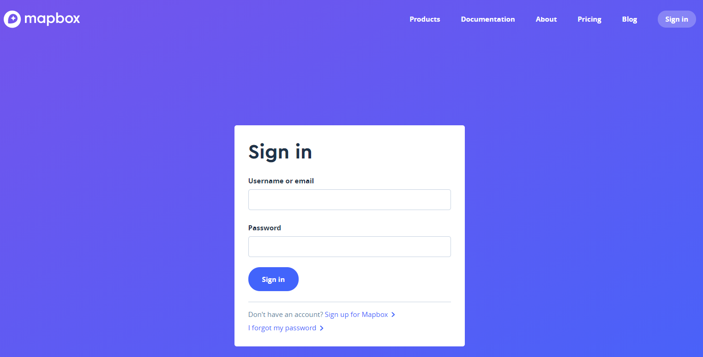
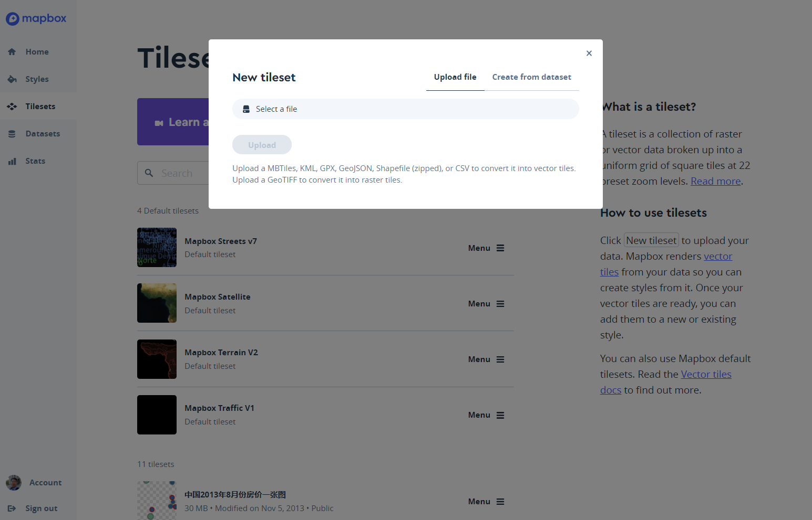
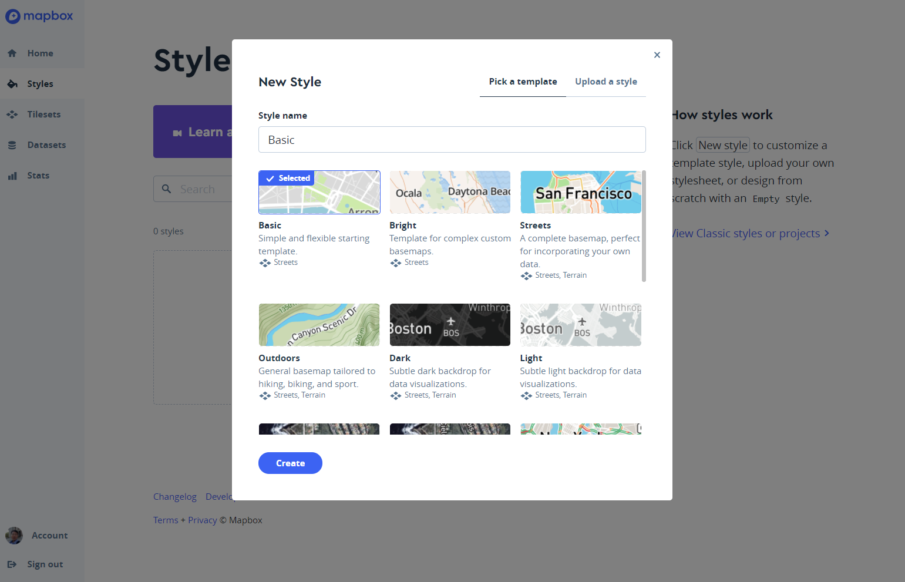
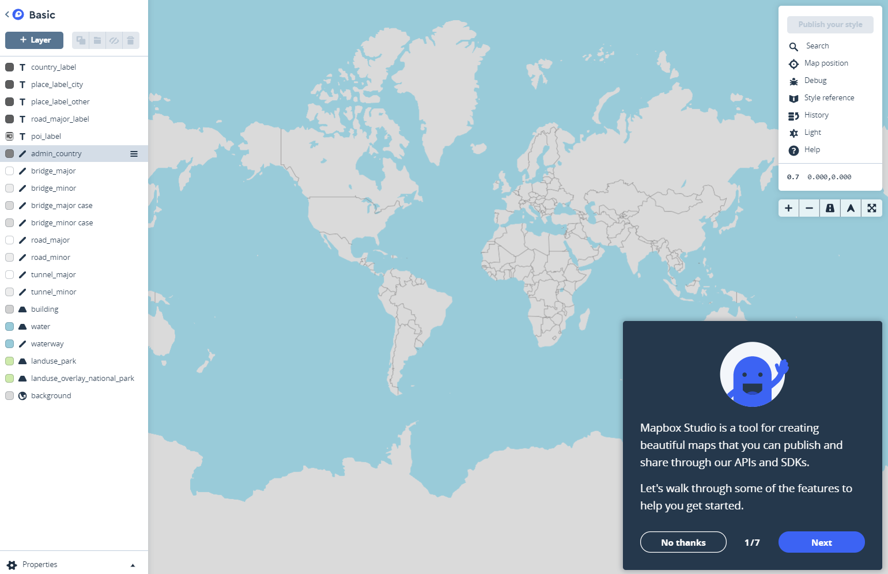
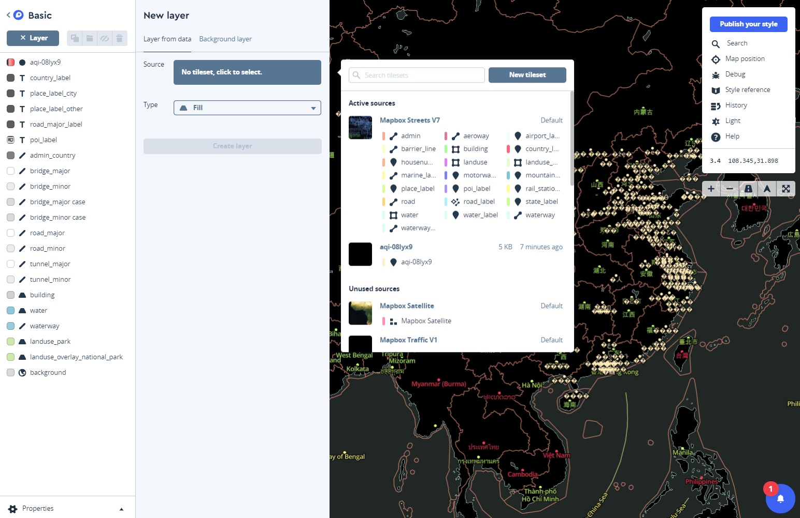
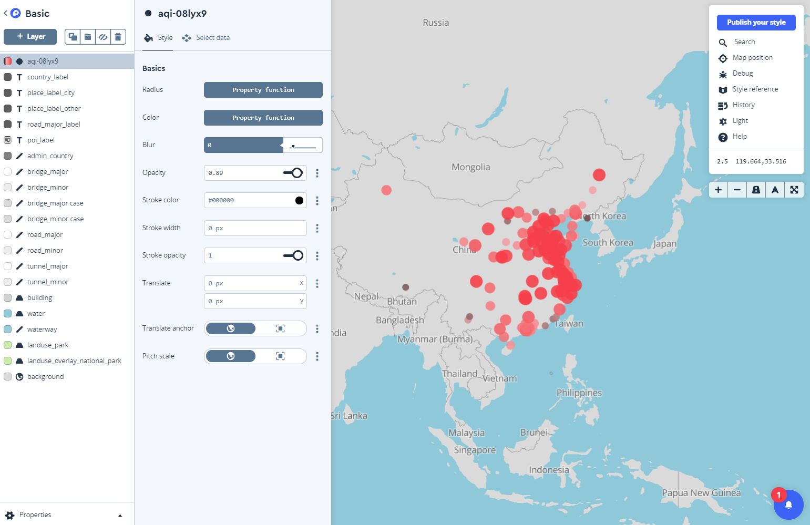
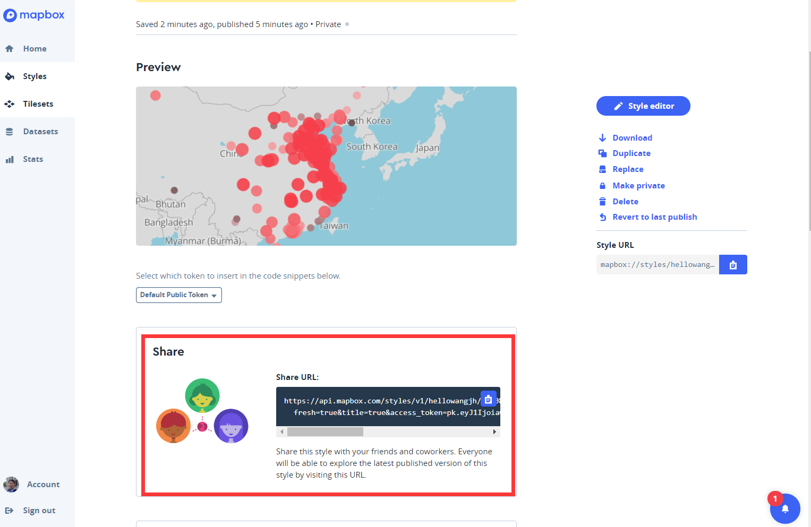

# 引言
本练习将介绍如何利用[Mapbox Studio](https://www.mapbox.com/mapbox-studio/)进行互联网制图。

> Mapbox Studio是[Mapbox](https://www.mapbox.com/)推出的网页版在线地图制作、设计、以及发布的平台，同时也可以来管理用户的空间数据。通过Mapbox Studio，你可以在几分钟内发布自己的地图，并使用Web来加载显示自定义地图，并可以使用Web、iOS、Android平台的SDK，或者QGIS、ArcGIS等客户端来加载显示自定义地图。

# 快速入门

## 注册Mapbox Studio账号

打开[Mapbox注册页面](https://www.mapbox.com/signup/)，输入用户名、邮箱、密码（必须大于8个字符）来注册账号。

## MapboxStudio主界面

注册并验证成功后，即可打开[Mapbox Studio](https://www.mapbox.com/mapbox-studio/)主页，进入主界面。界面左侧显示了Mapbox Studio如下几个部分： 

- __Home__：Mapbox Studio首页，账号基本信息，以及连接到Styles, Tilesets, 以及Datasets页面的快速入口； 
- __Styles__：创建、管理、及编辑地图Styles；
- __Tilesets__：创建、管理、及上传地图Tilesets；
- __Datasets__：创建、管理、及上传地图Datasets；
- __Stats__：账号中地图的使用情况统计； 
- __Account__：账号管理；

## 上传数据

切换到Datasets页面，点击“New Dataset”，弹出New Dataset对话框，我们选择“Upload”从本地上传一个包含地理信息文件，其中支持的文件格式为GeoJSON或者CSV等。本教程中，我们上传一个全国分省的GeoJSON文件和空气质量csv文件（https://github.com/Jianghao/ucasmap/tree/gh-pages/data/ 中的 china.json 和aqi.csv）。上传成功后，即可在Datasets页面查看到，点击数据对应的“Edit”，即可进行编辑。

## 编辑数据

你也可以创建一个空的Dataset，然后在编辑窗口对它进行再编辑、或者添加/删除几何元素等。

## 创建Tilesets

你可以对自己账号中的Dataset数据，通过”Export“的方式导出为Tileset，生成与Dataset对应的Tileset切片数据。此外你也可以直接在Tilesets页面创建一个新的tileset，并上传包括[MBTiles](https://www.mapbox.com/help/define-mbtiles/)、KML、GeoJSON、Shapefile(zipped)、CSV、以及GeoTIFF等格式的数据(详细的数据格式要求，请见[这里](https://www.mapbox.com/help/uploads/))。通过Tileset上传的数据，Mapbox Studio将直接转换为切片数据，因此不能再进行编辑（这也是Tilesets与Dataset的区别）。

## 创建Style

打开Styles页面，点击“New style”来创建一个新的地图style，你可以选择不同风格样式来创建地图sytle，Mapbox Studio已经为您预设了好几种地图样式：Basic，Bright，Streets，Outdoors，Dark，Light，Satellite，Traffic Day等。

点击创建的Style所对应的“Edit”，即可进入Sytle编辑页面。页面左侧列表为当前Sytle中所有的图层，右侧为地图显示区，右上角可实时设置当前地图的position、zoom、pitch、north、light，以及Search、Help等快捷工具。

## 添加新图层

点击“New layer”来创建添加新的图层，点击“No tileset, click to select”来选择新图层的Source，在这里我们选择刚刚创建的Tileset，同时需要指定图层的类型Type（Fill、Fill Extrusion、Line、Circle、Symbol等），这里我们选择Line。另外我们也可以设置图层的Filter，包括Geometry type，或者通过图层的字段Filed来进行Filter。

## 设置图层样式 

我们已经在Sytle中添加了自己的图层，接下来我们可以对图层的样式进行设置。对于Line类型的图层，你可以设置图层基本Basics样式，包括：Color，Pattern、Opacity、Width、Cap、Join、Round limit、Miter limit，以及可选Options样式：Dash array、Gap width、Blur、Offset、Translate、Translate anchor等。此外，您也可以设置其他已有图层的样式，比如建筑物、河网、道路等图层，实现自定义的效果。

## 发布Sytle地图

我们已经创建了Style，并且添加了自己的图层数据、设置了图层的样式，接下来就要发布地图。

点击sytle编辑页面左上角的“Publish”，即可发布地图。同样在Sytles页面，点击对应style的菜单，可以查看到Sytle URL，你可以点击“Share, develop & use”来查看样式的基本信息，以及发布的规则。在页面的右侧点击“Preview”即可立即在页面中打开地图。

# 帮助与实例

## 更多帮助
- Mapbox Studio Manual: https://www.mapbox.com/help/studio-manual/
- Tutorials and examples：https://www.mapbox.com/help/studio-manual-tutorials/

## 更多实例
- http://jianghao.wang/bus/
- http://jianghao.wang/HousePrice/

